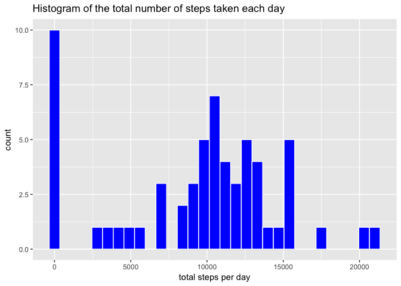
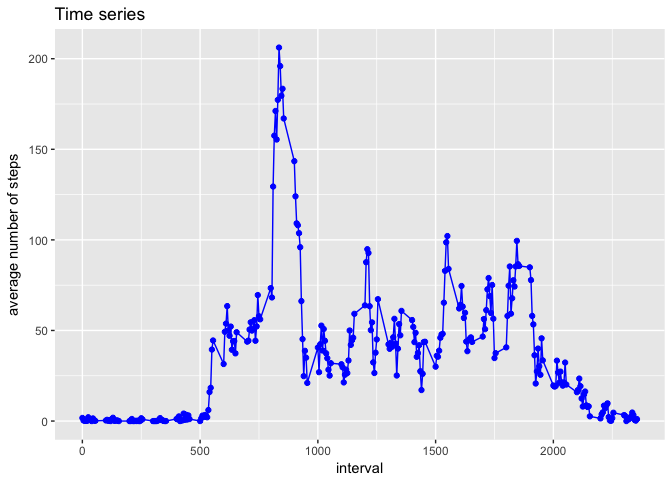
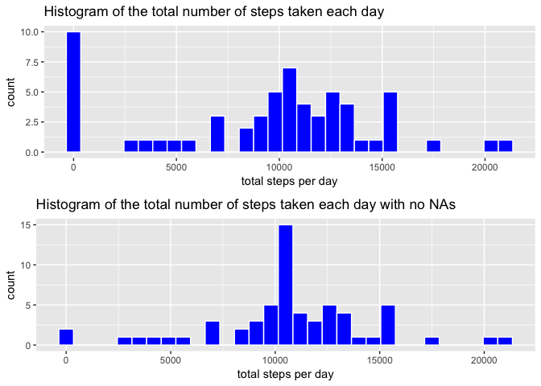
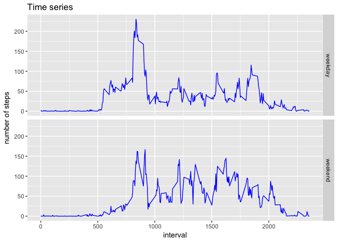

# Reproducible Research: Peer Assessment 1


## Loading and preprocessing the data

In this section I am showing any code that is needed to:

1. Load the data (i.e. `read.csv()`)


```r
activity <- read.csv(unz("activity.zip", "activity.csv"), header = TRUE, stringsAsFactors = FALSE, na.strings = "NA")
```

2. Process/transform the data (if necessary) into a format suitable for your analysis


```r
require(dplyr)
```

```
## Loading required package: dplyr
```

```
## 
## Attaching package: 'dplyr'
```

```
## The following objects are masked from 'package:stats':
## 
##     filter, lag
```

```
## The following objects are masked from 'package:base':
## 
##     intersect, setdiff, setequal, union
```

```r
activity <- mutate(activity, date = as.Date(date))
```


## What is mean total number of steps taken per day?

For this part of the assignment, I am ignoring the missing values in the dataset.

1. I am calculating the total number of steps taken per day.


```r
activityByDay <- group_by(activity, date)
stepsPerDay <- summarise(activityByDay, total = sum(steps, na.rm = TRUE))
```

2. I am making a histogram of the total number of steps taken each day.


```r
library(ggplot2)
histStepsPerDay <- ggplot(data = stepsPerDay, aes(x = total)) + 
     geom_histogram(col = "white", fill = "blue", binwidth = 700) +
     labs(title = "Histogram of the total number of steps taken each day") +
     labs(x = "total steps per day")
print(histStepsPerDay)
```

<!-- -->

3. I am calculating and reporting the mean and median of the total number of steps taken per day.


```r
summary(stepsPerDay$total)
```

```
##    Min. 1st Qu.  Median    Mean 3rd Qu.    Max. 
##       0    6778   10395    9354   12811   21194
```


## What is the average daily activity pattern?

1. I am making a time series plot (i.e. `type = "l"`) of the 5-minute interval (x-axis) and the average number of steps taken, averaged across all days (y-axis)


```r
activityByInterval <- group_by(activity, interval)
meanStepsPerInterval <- summarise(activityByInterval, mean = mean(steps, na.rm = TRUE))
pMeanStepsPerInterval <- ggplot(data = meanStepsPerInterval, aes(x = interval, y = mean)) + 
     geom_line(col = "blue") +
     geom_point(col = "blue") +
     labs(title = "Time series") +
     labs(x = "interval", y = "average number of steps")
print(pMeanStepsPerInterval)
```

<!-- -->

2. Which 5-minute interval, on average across all the days in the dataset, contains the maximum number of steps?


```r
meanStepsPerInterval[meanStepsPerInterval$mean == max(meanStepsPerInterval$mean), 1]
```

```
## # A tibble: 1 x 1
##   interval
##      <int>
## 1      835
```


## Imputing missing values

Note that there are a number of days/intervals where there are missing values (coded as `NA`). The presence of missing days may introduce bias into some calculations or summaries of the data.

1. I am calculating and report the total number of missing values in the dataset (i.e. the total number of rows with `NA`s)


```r
count(activity[is.na(activity$steps),])
```

```
## # A tibble: 1 x 1
##       n
##   <int>
## 1  2304
```

2. As a strategy for filling in all of the missing values in the dataset I am using the mean for tthe 5-minute interval.

3. I am creating a new dataset that is equal to the original dataset but with the missing data filled in.


```r
activityNoNa <- activity
for (i in 1:nrow(activityNoNa)){
     if(is.na(activityNoNa[i, "steps"])){
          activityNoNa[i, "steps"] <- 
               meanStepsPerInterval[meanStepsPerInterval$interval == activityNoNa[i, "interval"], "mean"]
     }
}
```

4. I am makig a histogram of the total number of steps taken each day and calculating and reporting the **mean** and **median** total number of steps taken per day.


```r
activityByDayNoNa <- group_by(activityNoNa, date)
stepsPerDayNoNa <- summarise(activityByDayNoNa, total = sum(steps))
histStepsPerDayNoNa <- ggplot(data = stepsPerDayNoNa, aes(x = total)) + 
     geom_histogram(col = "white", fill = "blue", binwidth = 700) +
     labs(title = "Histogram of the total number of steps taken each day with no NAs") +
     labs(x = "total steps per day")
require(gridExtra)
```

```
## Loading required package: gridExtra
```

```
## 
## Attaching package: 'gridExtra'
```

```
## The following object is masked from 'package:dplyr':
## 
##     combine
```

```r
grid.arrange(histStepsPerDay, histStepsPerDayNoNa, ncol = 1)
```

<!-- -->


```r
summary(stepsPerDay$total)
```

```
##    Min. 1st Qu.  Median    Mean 3rd Qu.    Max. 
##       0    6778   10395    9354   12811   21194
```

```r
summary(stepsPerDayNoNa$total)
```

```
##    Min. 1st Qu.  Median    Mean 3rd Qu.    Max. 
##      41    9819   10766   10766   12811   21194
```

As we can see, these values differ from the estimates from the first part of the assignment. By imputing missing data on the estimates of the total daily number of steps we concentrate the highter number of steps in the midle of the day.


## Are there differences in activity patterns between weekdays and weekends?

I am using the dataset with the filled-in missing values for this part.

1. I am creating a new factor variable in the dataset with two levels -- "weekday" and "weekend" indicating whether a given date is a weekday or weekend day.


```r
typeDay <- function(date) {
    day <- weekdays(date)
    if (day %in% c("Monday", "Tuesday", "Wednesday", "Thursday", "Friday")) 
        return("weekday") 
    else if (day %in% c("Saturday", "Sunday")) 
        return("weekend") 
}
activityNoNa$typeDay <- as.factor(sapply(activityNoNa$date, FUN = typeDay))
```

2. I am making a panel plot containing a time series plot (i.e. `type = "l"`) of the 5-minute interval (x-axis) and the average number of steps taken, averaged across all weekday days or weekend days (y-axis).


```r
activityByIntervalNoNa <- group_by(activityNoNa, interval, typeDay)
meanStepsPerIntervalNoNa <- summarise(activityByIntervalNoNa, mean = mean(steps))
pMeanStepsPerIntervalNoNa <- ggplot(data = meanStepsPerIntervalNoNa, aes(x = interval, y = mean)) + 
     geom_line(col = "blue") +
     labs(title = "Time series") +
     labs(x = "interval", y = "number of steps") +
     facet_grid(typeDay ~ .)
print(pMeanStepsPerIntervalNoNa)
```

<!-- -->
